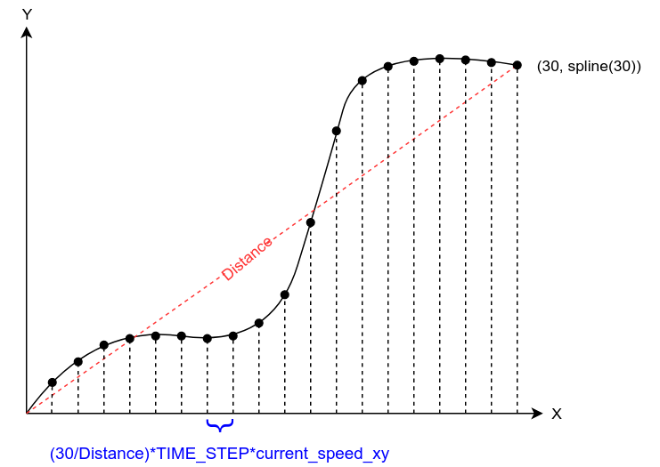
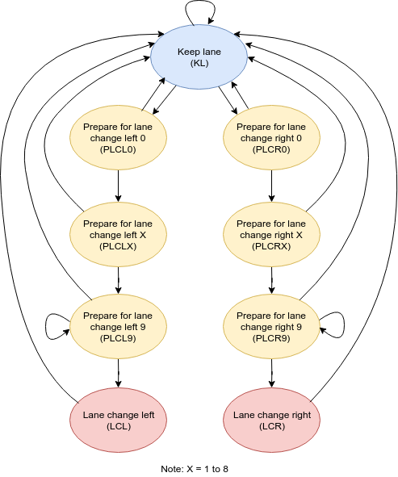

# Self driving car nanodegree 

## Project 7: Highway driving

This project consists of a behavior and trajectory planner capable of driving a car on a highway safely and efficiently. The system uses the positions and  velocities of the other vehicles on the road in order to determine the optimal action at every update cycle.

This software is programmed in C++11 using the standard template library.

The software uses a mix between cartesian and [Frenet coordinates](https://en.wikipedia.org/wiki/Frenet%E2%80%93Serret_formulas) in order to make the calculations easier. For those transformations, the file ./data/map_data.txt is readed by the software. The software works together with the [ Udacity term 3 simulator ](https://github.com/udacity/self-driving-car-sim) which sends the position on xy, the velocities on xy and the positions on sd of the controlled vehicle as well as of the other cars and receives a vector of points that it executes sequentially to move the controlled vehicle on the simulator. It also sends two vectors corresponding to the control points that were sent to the simulator but were still not executed since the simulator and this software are not syncronized.  To communicate this software with the simulator the [uWebSockets API](https://github.com/uNetworking/uWebSockets) is used. 

To compile the software, GCC 7.4.0 and CMake 3.15.0-rc1 is used.

The purpose of this software is to implement a highway behavior planner which generates optimal trajectories with minimized jerk. That being said, the project can be separated in two modules which work together in order to get the final result. These modules will be called from here on "Behavior planner" and "Trajectory generator". Both modules are part of the class "ego_vehicle".  

### About the trajectory generator
The trajectory generator performs the following tasks:
- Determine the velocity, acceleration and lane of the ego vehicle for different actions like keeping the lane or changing to another one. This task is done by the methods "keepLaneTraj", "prepLaneChangeTraj" and "laneChangeTraj" together with the auxiliar methods "getKinematicsOfLane", "getVehicleAhead" and "getVehicleBehind".
- Keeping track of the current velocity, acceleration and lane of the vehicle and update them softly on every software cycle. This task is performed by the method "updateTrajectory".
- Convert the current velocity, current acceleration and current lane data to a "continuous" trajectory given by two lists of points that the simulator can read and execute. This task is performed by the method "getNewPosPoints".

It is important to mention that no start or final position is used here, since for this project the ego vehicle should drive on a loop without end goal. So instead of calculating a trajectory for a defined start and end position, a horizon value is used as end position.

#### Trajectory data generation for keeping lane, preparing to change lane and changing lane

##### Trajectory data generation for keeping lane
This is performed by the "keepLaneTraj" and consists of observing the velocity and position of other cars on the current lane and changing the velocity and acceleration of the ego vehicle so it keeps the lane without hitting another car. In order to determine the velocity and acceleration the ego vehicle should take, the method "getKinematicsOfLane" is used on the current lane of the ego vehicle. This method determines the optimal velocity and acceleration of the ego vehicle for this cycle on a given lane. In order to avoid hitting a vehicle ahead of the ego vehicle, the maximal velocity is calculated as:

$$ v_{maxOnFront} = (s_{vah} - s_{ego} + db) + v_{vah} - 0.5 a_{ego}       (1) $$ 

Where:
$ v_{maxOnFront} $ : Maximum speed in order to not hit car on front
$ s_{vah} $ : Position s (Frenet) of closest vehicle on front to ego vehicle (m)
$ s_{ego} $ : Position s of ego vehicle (m)
$ db $ : Distance buffer between ego vehicle and closest vehicle (m)
$ v_{vah} $ : Velocity on s of closest vehicle on front to ego vehicle (m/s)
$ a_{ego} $ : Acceleration s of ego vehicle (m/s^2)

If $ v_{maxOnFront} $ is higher than either the target speed (speed limit) or the speed with acceleration limit, or if there is not a vehicle in front of the ego vehicle, the minimum of them is selected as the velocity of the lane. The acceleration is calculated simply as the subtraction between the recently calculated new velocity of the ego vehicle and its current velocity.

##### Trajectory data generation for preparing to change lane
First of all, here two concepts need to be defined, "intended lane" and "final lane". Intended lane is the lane the ego vehicle should take at the end of the changing lane process, so, in case of this state corresponds to the lane is wanted to change to. Final lane is the lane the ego vehicle will have at the end of this state, in this case, it will be the same lane where it is now.

The method "prepLaneChangeTraj" gets the best velocity and acceleration the vehicle can have before a lane change. This method checks if there is a vehicle behind the ego vehicle on the current lane within a search range. It that is the case, the velocity and acceleration selected are the ones of the current lane. Otherwise, the velocity and acceleration of the lane with the lowest current velocity is selected, so the ego vehicle brakes to the speed of the intended lane before it moves to that lane, although this case is unlikelly on this project since lane changes are done only to maximize the speed of the ego vehicle, it would be usefull in the case the car needs to go out of the highway.

##### Trajectory data generation for lane change
The method "laneChangeTraj" first verifies if there is another vehicle ahead and behind the ego vehicle within a search range. If that is the case, the velocity and acceleration is assigned to be 0, so this state will be automatically rejected when looking for the next state of the finite state machine. Otherwise, if there is not another vehicle ahead and behind the ego vehicle, the velocity and acceleration of the new lane are selected. In this case both final and intended lane are the lane the car will change to.

#### Update of current velocity and acceleration
The method "updateTrajectory" chooses the new state with its corresponding trajectory using the method "chooseNewState" of the behavior planner. Then with that information it updates the current acceleration, making it a step closer to the acceleration corresponding to the selected trajectory. Finally, with the new acceleration it updates the current velocity making it also a step closer to the velocity corresponding to the selected trajectory. 

#### Trajectory points generation
After the current velocity is calculated, its value is used to generate lists of points which define a trajectory on XY which is sent to the simulator. In order to do that, first it is verified if there are trajectory points which were already sent to the simulator but not yet executed. If that is the case, the last two points are used as the beginning of the new trajectory, if not, the current position of the ego vehicle is used as the starting point. These points are collected within two lists which will be used after to interpolate a trajectory. Also all the points that were already sent to the simulator but not yet executed are pushed to other two lists that correspond to the points that are sent to the simulator later. 

Then, three points in [Frenet coordinates](https://en.wikipedia.org/wiki/Frenet%E2%80%93Serret_formulas) are selected. The coordinate s of these points is separated 30 meters from each other starting from the current s position of the ego vehicle and the coordinate d corresponds to the one at the center of the lane selected by "updateTrajectory".
These points are converted to cartesian coordinates and then also collected within the list for interpolation.

[Using Euclidean transformations](https://en.wikipedia.org/wiki/Cartesian_coordinate_system#Euclidean_transformations) all the points on the list are transformed from the cartesian plane of the map to a cartesian plane with origin on the current XY position of the ego vehicle and rotated with an angle given by its current yaw. The purpose of this transformation is getting an interpolated function with origin at the current position of the ego vehicle, that does not depend on the map.

The next step is to create a function from x to y interpolating all the transformed points on the lists using the [Spline library of Tino Kluge](https://kluge.in-chemnitz.de/opensource/spline/). Then, a target position x = 30 is selected and the XY points in between of the spline function are selected as shown on the following diagram:

 

The difference on X between every point depends on the Euclidean distance between the points (0,0) and (30, spline(30)), the time step which in this case is 0.020 seconds and the current speed of the car, which is determined by "updateTrajectory". All these points are transformed back to the coordinate system of the map and then are pushed to the lists of points that are sent to the simulator.

### About the behavior planner

The behavior planner is responsible of deciding what the next action of the ego vehicle will be. In order to do that, a finite state machine (FSM) and cost functions are used. 

The finite state machine used has 5 states: Keep lane, prepare lane change left, prepare lane change right, lane change left and lane change right. The action that they take is explained above in the trajectory data generation part. In order to avoid very fast lane changes, the prepare to lane change states are actually 10 equal states executed one after the other, ensuring that the finite state machine stays at least 10 cycles preparing for a lane change. The finite state machine can be explained better with the following drawing:

 

The method that decides which state will the finite state machine take on the next cycle is "chooseNewState". This method is called by "updateTrajectory" on every cycle. This method loops through all the possible next states the FSM could have, starting from the current state and generate the corresponding trajectories for all those states using "generateStateTraj". The method "generateStateTraj" calls the corresponding trajectory data generation function which is then used by "getTotalCost" which calculates the "cost" needed to execute that trajectory.

After having the costs for all the possible next states, the state with the minimum cost is selected and its trajectory data is used by "updateTrajectory".

#### Cost functions
The cost functions asigns a cost to a determined behavior which can be described by a mathematical expresion. All the cost functions return a value between 0 and 1, so they can be compared between each other. 

##### Cost for the average speed of the intended and final lanes (avgLaneSpeedCost)
This cost function asigns a cost inversely proportional to the speed of the intended and final lanes. So if the ego vehicle is intending to change to a slower lane, the cost given by this function will be higher than staying on the current lane. Otherwise, if the current lane is slower than a lane besides, the cost of staying on the lane will be higher than moving to the faster one. In order to determine the average speed of the lane, the speeds of the vehicles until 50 meters ahead are used. If no vehicle within the range is found, the average speed of the lane corresponds to the speed limit and the cost of mooving to that lane for this function is 0.

##### Cost for the speed of the next vehicle on the lane (NextCarOnLaneSpeedCost)
This cost function asigns a cost inversely proportional to the speed of the next vehicle found on the intended and final lanes within 10 meters. So if there is a vehicle  in two possible final lanes, the cost will be higher for the state which decides to go to the lane with the slowest vehicle. If no vehicle is found on the intended and final lanes, the cost will be 0 for this function. 

##### Cost for the distance to the next vehicle on the lane (NextCarOnLaneDistCost)
This cost function asigns a cost inversely proportional to the distance to the next vehicle found on the intended and final lanes within 10 meters. So if there is a vehicle in two possible final lanes, the cost will be higher for the state which decides to go to the lane with the closest vehicle. If no vehicle is found on the intended and final lanes, the cost will be 0 for this function. 

##### Cost for the distance of the ego vehicle to the fastest lane (distFromFastestLaneCost)
This cost function asigns a cost directely proportional to the distance of the ego vehicle to the lane with the highest average speed. This cost function complements the first cost function and helps to avoid the case where the ego vehicle is two lanes far away from the fastest lane and cannot reach it because the current lane is faster than the lane in between. 

##### Cost for lane change when the ego vehicle is too slow (laneChangeWhenSlowCost)
This cost function asigns a cost inversely proportional to the current speed of the ego vehicle when a lane change is intended, so it avoids the ego vehicle to change lanes when its speed is too slow, for example, when the simulation starts. This is because doing lane changes when the ego vehicle is too slow makes it unpredictable for the other vehicles on the intended lane and can cause collisions.

##### Cost for lane change in general (laneChangeCost)
This cost function asigns a cost when a lane change is intended, so doing a lane change when all other conditions are the same on the other lane is more expensive than just staying on the same lane. Therefore this cost function avoids lane changes when they are absolutely not needed. 

##### Weighing system for the cost functions
Weight are asigned to each of them to make a kind of hierarchy system between them where some are more important than the others. After doing a lot of testing, the best hierachy from the cost function with the highest cost to the one with the lowest cost is the following: laneChangeWhenSlowCost > avgLaneSpeedCost > distFromFastestLaneCost > NextCarOnLaneDistCost > NextCarOnLaneSpeedCost > laneChangeCost.

### Results
With the final implementation, the ego vehicle is capable to drive on the simulator for longer than 15 minutes without causing any incidents. as it can be seen on the following video: 

 

The ego vehicle is capable of resolving even difficult situations like being "trapped" at the slowest lane two lanes away from a complete empty lane. In this case, the vehicle will slow down and move first to the middle lane and then move to the empty lane at the other side of the road. An example of this behavior can be seen on the video between 5:40 and 6:00.

There are times when the vehicle seems to be too carefull about the other vehicles being behind on the intended lane and does the change too late. This could be resolved having a cost function inversely proportional to the distance with the closest car behind instead of the restriction on "laneChangeTraj", this was not done on this project since it can be also dangerous if this cost function is not weighted enough.

Other problem occurs when the ego vehicles decides to move two lanes directly on a curve in direction of the lane change. When this happens the vehicle exceeds the maximum acceleration allowed for a short moment. In order to minimize this, the states to prepare to change lane (PLCL and PLCR) were changed by 10 equal states as shown above, so the vehicle is obligated to stay on the middle lane for at least 10 cycles. It does not avoid it completely though, but it happens very rarely.

### How to use
The software is already compiled in this repository in the folder "build", but here is explained how it can be compiled again:

- Install the required dependencies: gcc/g++ >= 5.4, make >= 4.1, cmake >= 3.5.
- Install uWebSockets using the file ./install-linux.sh
- Delete the directory build and create a new one with: mkdir build.
- Move to the build directory with: cd build.
- Compile with: cmake .. && make.
- Run the program with: ./path_planning.
- Open the term 3 simulator and select Project 1: Path planning.
- Press start and see how the simulation runs.

These steps are for a linux environment. For other operative systems see the [Udacity's repository](https://github.com/udacity/CarND-Path-Planning-Project).

 

